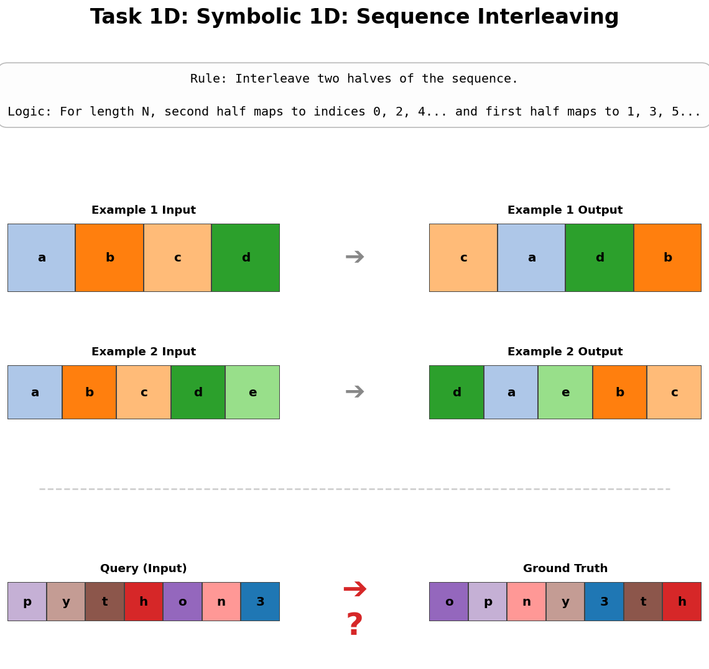
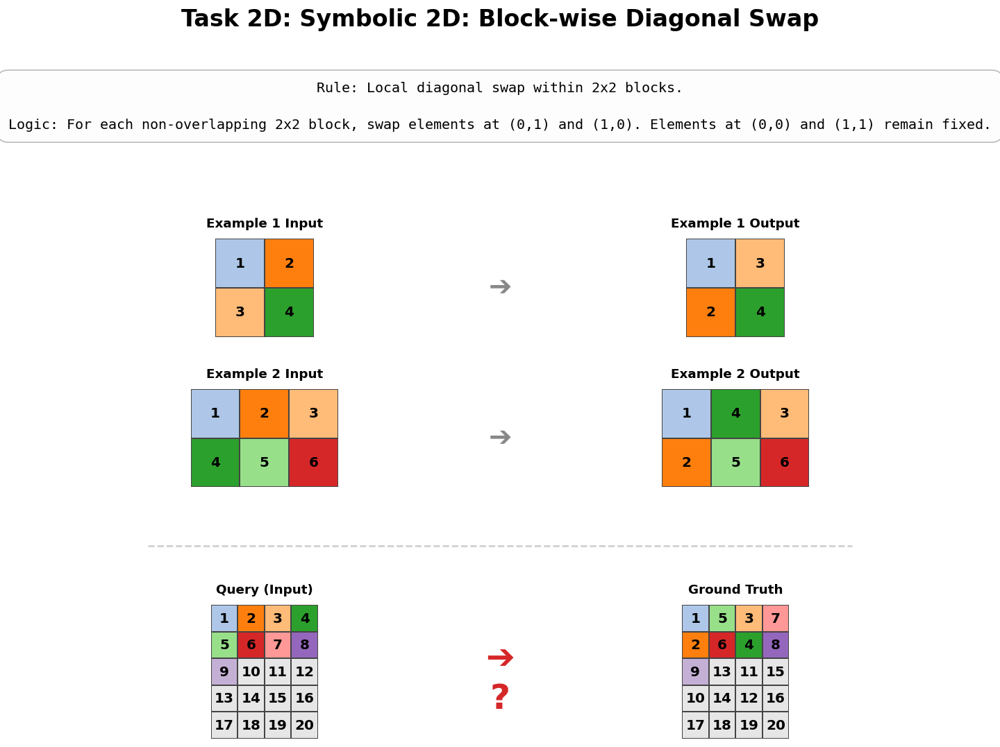
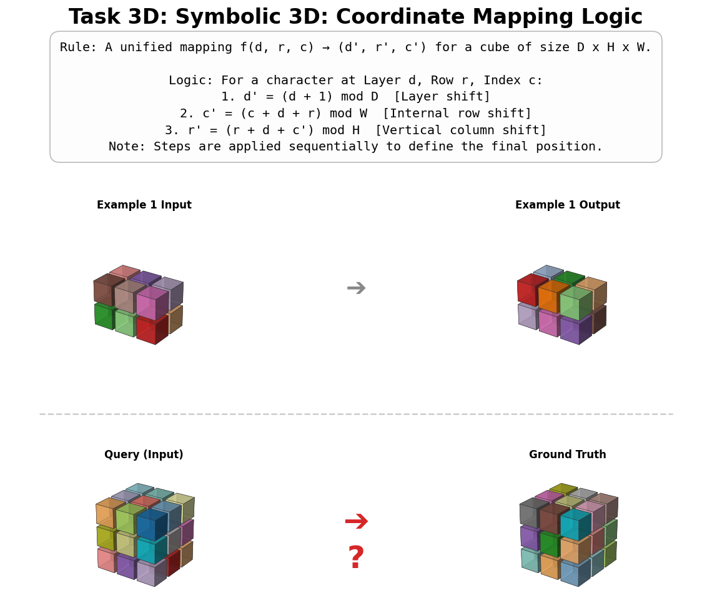

# A²RBench: Automated Paradigm for Formally Verifiable Abstract Reasoning


This repository contains the official implementation of the pipeline described in the paper: **"A²RBench: An Automatic Paradigm for Formally Verifiable Abstract Reasoning Benchmark Generation"**.

A²RBench is an automated framework that leverages LLMs to generate, verify, expand, and evaluate abstract reasoning tasks. It ensures logical soundness through **Cycle Consistency Check ($g(f(x)) = x$)** and code-based verification.

---

## 🌟 Task Visualizations

A²RBench generates tasks across 1D, 2D, and 3D dimensions. Below are examples of the symbolic transformation rules:

| **1D: Sequence Interleaving** | **2D: Block-wise Diagonal Swap** | **3D: Coordinate Mapping** |
| :---: | :---: | :---: |
|  |  |  |
| *Rule: Interleaving two halves.* | *Rule: Local 2x2 diagonal swaps.* | *Rule: Multi-axis cyclic shifts.* |

---

## 📂 Repository Structure

```text
.
├── llm_client.py           # Unified API wrapper for various LLM providers (OpenAI, Gemini, etc.)
├── question.py             # Stage 1: Seed Generation (Rules & Code) via Cycle Consistency
├── expand_questions.py     # Stage 2: Task Expansion (Variations V0-V9)
├── answer.py               # Stage 3: Solver Evaluation (P0 & P1 perturbations)
├── analysis.py             # Stage 4: Global Performance & Symbolic Dependency Analysis
├── analyze_complexity.py   # Analysis: Code Complexity (AST) & Author Fingerprinting
├── classify_failures.py    # Analysis: Cognitive Failure Classification (CoT Diagnosis)
└── analysis_expand.py      # Analysis: Augmentation Paradox & Entropy Analysis
```

---

## 🛠️ Installation

1. **Clone the repository:**
2. **Install dependencies:**

---

## 🚀 Usage Pipeline

The pipeline consists of four sequential stages.

### Stage 1: Seed Generation

Generates valid Python-based abstract reasoning rules (Forward $f$ and Inverse $g$) and verifies them via Cycle Consistency. Supports 1D, 2D, and 3D tasks.

```bash
python question.py
```

*Outputs: `questions_arc_text_v9/validated_arc_text_questions.jsonl`*

### Stage 2: Task Expansion

Augments the seed tasks into 9 distinct variations (Standard, Edge Case, Adversarial) to test robustness.

```bash
python expand_questions.py
```

*Outputs: `questions_arc_text_v9/expanded_arc_text_questions.jsonl`*

### Stage 3: Solver Evaluation

Evaluates various "Solver" LLMs on the generated tasks. This script handles **Symbolic Dependency Testing** by creating symbol-remapped versions (P1) of the tasks.

```bash
python answer.py
```

*Outputs: `results_arc_text_v9/results_raw.jsonl`*

### Stage 4: Analysis & Metrics

1. **Global Leaderboard:** Generate accuracy tables and symbolic dependency gaps.
   ```bash
   python analysis.py
   ```
2. **Code Complexity:** Analyze AST of generated rules (loop depth, conditional complexity).
   ```bash
   python analyze_complexity.py
   ```
3. **Cognitive Failure Diagnosis:** Diagnose *why* a model failed (e.g., Abstraction vs. Reasoning).
   ```bash
   python classify_failures.py
   ```

---

## 📊 Data Format

Each generated task includes executable Python code, a natural language rule description, and the puzzle data.

```json
{
  "question_id": "SYM_O4_D3_001_V0",
  "task_type": "SymbolicRule",
  "dimensionality": 3,
  "rule_description": "Forward transformation (Encoder): ...",
  "python_code": "def transform_grid(grid): ...",
  "puzzle_data": {
    "examples": [{"input": [...], "output": [...]}],
    "question_plaintext": [...],
    "answer_ciphertext": [...]
  }
}
```

## ⚖️ License

This project is licensed under the MIT License.
